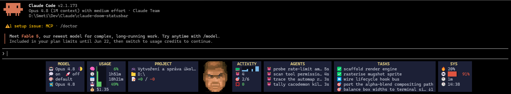

# claude-doom-statusbar

A DOOM-inspired status bar for the [Claude Code](https://docs.claude.com/en/docs/claude-code) CLI. Your session, read off the Doomguy HUD: a mugshot whose face tracks your health, boxes for usage, model, project and system, and live lists of running agents and tasks.

<p align="center">
  
</p>

The mugshot is the real DOOM (1993) status-face sprite, rasterised into the terminal at runtime — not ASCII art of it.

## What it shows

The HUD is a row of boxes centred on the mugshot. Each box is configurable; the `full` preset turns everything on:

- **mugshot** — the Doomguy face. Its HP (how bloodied it looks) follows your *usage headroom* — `min(5h, 7d) rate-limit room`, context as a fallback. It glances around when idle, winces on errors, snarls on writes, grins on a clean finish, dies when you're tapped out, and flashes invulnerable just after an advisor consult.
- **MODEL** — model name + reasoning effort (a waxing-moon→sun icon), thinking/fast toggles, output style, and the configured `/advisor` model.
- **USAGE** — context window (HP bar), the 5h / 7d rate-limit bars (with reset countdowns), RAM, session cost.
- **PROJECT** — session name, cwd, git branch, a merged work line (changed files + ahead/behind), lines added/removed, PR state. The cwd, branch and PR are **clickable** (OSC 8 hyperlinks): Ctrl/Cmd-click to open the folder, the branch on the host, or the pull request. Long names are clipped to 24 chars so the box can't blow up.
- **ACTIVITY** — a tool-activity "geiger" sparkline (duty-cycle over the last 30 s), running-agent count, task progress, error count.
- **AGENTS** — a live list of running subagents (type/description + ticking runtime), always visible. Long lists scroll within the box height, with ↑/↓ markers counting the rows hidden off-screen.
- **TASKS** — the session's todo list: settled items (✅ done, ❌ removed) on top, open items (⏩ in-progress, 🎯 pending) below. Scrolls like AGENTS, anchored on the open/settled boundary.
- **SYS** — CPU, disk, session length, wall clock.

Anything the session can't supply is hidden automatically, so the same config degrades cleanly.

## Requirements

- **Node.js 18+**. One runtime dependency (`smol-toml`, a TOML parser); everything else is Node built-ins.
- **[chafa](https://hpjansson.org/chafa/)** — *optional*. With it, the mugshot rasterises at any height. Without it, the HUD falls back to pre-rendered ANSI faces (heights 4–16, clamped to the nearest), so the mugshot still draws.
- A terminal with **truecolor** and **legacy-computing glyph** support (the mugshot and fine bars use Unicode block/sextant/octant glyphs). Windows Terminal, WezTerm, kitty, foot all work.

## Install

```bash
npx claude-doom-statusbar install
```

That writes the `statusLine`, the lifecycle hooks, and the preset into `~/.claude/settings.json` for you (merging into whatever's already there, with a one-level `.bak`). Restart Claude Code and the HUD is live.

```bash
npx claude-doom-statusbar install --preset full   # full | standard | minimal (default: full)
npx claude-doom-statusbar install --project       # write ./.claude/settings.json instead of ~/.claude
npx claude-doom-statusbar uninstall                # remove everything the installer added
```

Prefer a global binary? `npm i -g claude-doom-statusbar` then run `claude-doom-statusbar install`.

The `statusLine` alone gives you the boxes and the HP/idle face. The hooks add the live reactions, the geiger, and the subagent list. The installer is idempotent and merge-safe: re-running won't double-add, and an existing `statusLine` of your own is backed up to `settings.json.bak`.

### Updating

```bash
npm i -g claude-doom-statusbar@latest    # global install
# or just run the latest on demand:
npx claude-doom-statusbar@latest install
```

### Clickable links

The cwd / branch / PR are emitted as OSC 8 hyperlinks. They render in any terminal but only click in ones Claude Code detects as hyperlink-capable (iTerm2, kitty, WezTerm, …). **Windows Terminal isn't auto-detected** — launch with `FORCE_HYPERLINK=1` to enable them:

```powershell
$env:FORCE_HYPERLINK = "1"; claude
```

## Presets

`DOOMBAR_PRESET` picks the layout (defaults to `presets/standard.toml`):

- **`minimal`** — a couple of bars, blends into the terminal.
- **`standard`** — balanced HUD.
- **`full`** — every box, the look in the screenshot above.

A preset is TOML: a `[bar]` style block, a `[mugshot]` block, and a list of `[[segment]]` boxes. Each box lists metrics with a render type — `bar`, `number`, `text`, `spark`, `ammo`, `list`, `scroll`, or a `group`. Copy one and rearrange the boxes, swap icons, or change which metrics show.

### Responsive width

As the terminal narrows, the HUD shrinks: bars contract and text columns shrink together, and whatever overflows scrolls (the marquee). When even the smallest layout no longer fits, the preset falls back to a smaller one via its `[bar].fallback` key — `full → standard → minimal`. Your chosen preset is the ceiling; widening the terminal recovers it. It's stateless — each refresh re-reads the terminal width (`COLUMNS`), so it follows live resizes.

## How it works

- **`src/statusline.js`** is the statusLine command. Claude Code pipes session JSON on stdin; it maps that (plus git via shell, system metrics from Node built-ins, and the hook state file) to metric values, picks the mugshot sprite, and renders the preset.
- **`src/hook.js`** is an event bus. Lifecycle hooks write a small state file (face reaction with decay, tool-run intervals for the geiger, the running-subagent squad). The status line reads it on each refresh — the two never block each other.
- **`src/render.js`** is the rendering engine; **`src/face.js`** rasterises the mugshot via chafa (with pre-baked transparent sprites as the fallback). **`bin/cli.js`** is the installer.

See [`docs/ideation/`](docs/ideation/) for the full design write-up.

## Credits

- The status-face sprites are from **DOOM** (1993), id Software.
- Mugshot rasterisation by **[chafa](https://hpjansson.org/chafa/)** (Hans Petter Jansson).
- Prior art that shaped what this HUD shows: **[claude-hud](https://github.com/jarrodwatts/claude-hud)** and **[ccstatusline](https://github.com/sirmalloc/ccstatusline)**.

## License

[MIT](LICENSE).
