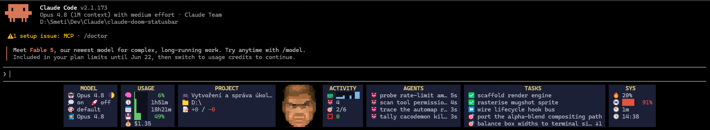

# claude-doom-statusbar

A DOOM-inspired status bar for the [Claude Code](https://docs.claude.com/en/docs/claude-code) CLI. Your session, read off the Doomguy HUD: a mugshot whose face tracks your health, boxes for usage, model, project and system, and live lists of running agents and tasks.

<p align="center">
  
</p>

The mugshot is the real DOOM (1993) status-face sprite, rasterised into the terminal at runtime — not ASCII art of it.

## What it shows

The HUD is a row of boxes centred on the mugshot. Each box is configurable; the `full` preset turns everything on:

- **mugshot** — the Doomguy face. Its HP (how bloodied it looks) follows your *usage headroom* — `min(5h, 7d) rate-limit room`, context as a fallback. It glances around when idle, winces on errors, snarls on writes, grins on a clean finish, dies when you're tapped out, and flashes invulnerable just after an advisor consult.
- **MODEL** — model name + reasoning effort (a waxing-moon→sun icon), thinking/fast toggles, output style, and the configured `/advisor` model.
- **USAGE** — context window (HP bar), the 5h / 7d rate-limit bars (with reset countdowns), RAM, session cost.
- **PROJECT** — session name, cwd, git branch, a merged work line (changed files + ahead/behind), lines added/removed, PR state. The cwd, branch and PR are **clickable** (OSC 8 hyperlinks): Ctrl/Cmd-click to open the folder, the branch on the host, or the pull request. Long names are clipped to 24 chars so the box can't blow up.
- **ACTIVITY** — a tool-activity "geiger" sparkline (duty-cycle over the last 30 s), running-agent count, task progress, error count.
- **AGENTS** — a live list of running subagents (type/description + ticking runtime), always visible. Long lists scroll within the box height, with ↑/↓ markers counting the rows hidden off-screen.
- **TASKS** — the session's todo list: settled items (✅ done, ❌ removed) on top, open items (⏩ in-progress, 🎯 pending) below. Scrolls like AGENTS, anchored on the open/settled boundary.
- **SYSTEM** — a per-core CPU equalizer (one threshold-coloured column per core) with the aggregate CPU % right-aligned beside it, disk, session length, wall clock.

Anything the session can't supply is hidden automatically, so the same config degrades cleanly.

## Requirements

- **Node.js 18+**. One runtime dependency (`smol-toml`, a TOML parser); everything else is Node built-ins.
- **[chafa](https://hpjansson.org/chafa/)** — *optional*. With it, the mugshot rasterises at any height. Without it, the HUD falls back to pre-rendered ANSI faces (heights 4–16, clamped to the nearest), so the mugshot still draws.
- A terminal with **truecolor** and **legacy-computing glyph** support (the mugshot and fine bars use Unicode block/sextant/octant glyphs). Windows Terminal, WezTerm, kitty, foot all work.

## Install

```bash
npx claude-doom-statusbar install
```

That writes the `statusLine`, the lifecycle hooks, and the preset into `~/.claude/settings.json` for you (merging into whatever's already there, with a one-level `.bak`). Restart Claude Code and the HUD is live.

```bash
npx claude-doom-statusbar install --preset full   # full | standard | minimal (default: full)
npx claude-doom-statusbar install --project       # write ./.claude/settings.json instead of ~/.claude
npx claude-doom-statusbar install --refresh 5     # also re-render on a 5s timer (0 = events only)
npx claude-doom-statusbar uninstall                # remove everything the installer added
```

Prefer a global binary? `npm i -g claude-doom-statusbar` then run `claude-doom-statusbar install`.

The `statusLine` alone gives you the boxes and the HP/idle face. The hooks add the live reactions, the geiger, and the subagent list. The installer is idempotent and merge-safe: re-running won't double-add, and an existing `statusLine` of your own is backed up to `settings.json.bak`.

### Updating

```bash
npm i -g claude-doom-statusbar@latest    # global install
# or just run the latest on demand:
npx claude-doom-statusbar@latest install
```

### Windows: Git Bash and the 1-second tick

The refresh interval is **1 second on every platform, Windows included**. On Windows that costs something, and this section explains what and how it's paid — the answer is not a slower tick.

Claude Code's `statusLine` has no exec form. Its entire schema is `type`, `command`, `padding`, `refreshInterval`, so there is no `args` array and the command is always handed to a shell. On Windows that shell is **Git Bash whenever Git for Windows is installed** — and nothing in your settings redirects it. `CLAUDE_CODE_GIT_BASH_PATH`, `CLAUDE_CODE_USE_POWERSHELL_TOOL` and `defaultShell` were all measured with no effect on it; renders still came from `C:\Program Files\Git\bin\bash.exe`. (`defaultShell` governs only the `!` shell-mode prefix.)

Each render therefore costs **two** MSYS initialisations, because `Git\bin\bash.exe` is a stub that re-execs `Git\usr\bin\bash.exe`. Healthy, each pair takes ~0.15 s and nothing accumulates — 1 Hz is comfortably sustainable. The danger is not the rate but a single **hung** init, which poisons Git Bash's shared MSYS section:

```
bash.exe: *** fatal error - add_item ("\??\C:\Program Files\Git", "/", ...) failed, errno 1
```

From then on the failure sustains itself. A healthy `bash -c` returns in ~0.3 s; a poisoned one hangs ~15 s before dying with `0xC0000005`. At 1 Hz a new wrapper starts long before the last one dies, so the population never reaches zero, the section never gets an instant with no holder, and it cannot heal on its own. Git Bash then looks broken machine-wide — `bash --version` included — on a perfectly intact install.

**The reaper is what makes 1 Hz safe.** It kills hung wrappers so the section gets its empty instant and heals. Measured on Win11 26200: a Git Bash spawn went from 15 233 ms + `0xC0000005` to **277 ms + exit 0** the moment the accumulated wrappers were killed.

It only ever targets `bash.exe` whose command line runs *this package's* `statusline.js` and which has outlived `DOOMBAR_MSYS_REAP_AGE` (default 10 000 ms, against ~300 ms for a healthy render). Such a shell is already hung and its render is lost either way; nothing else is ever touched.

It runs from two places, because neither alone covers a whole session:

- **From the hook**, on any Claude Code event, once live `bash.exe` reaches `DOOMBAR_MSYS_REAP_MIN` (default 4). This covers active work and reports the count into the HUD.
- **From the render**, throttled to once per `DOOMBAR_REAP_TICK` (default 15 000 ms). This covers **idle** sessions — no events arrive when you're not working, and idle is exactly when the 1 Hz timer is the only thing spawning shells. The kick is detached and unref'd, so a render never waits on it (measured: 207 ms with the reaper armed).

Set `DOOMBAR_MSYS_REAP=0` to disable both. The `sys.zombies` metric shows the live `bash.exe` count, so a forming pile is visible before it bites.

If Git Bash is *already* poisoned and you'd rather rebase than wait for the reaper, close Claude Code and every Git Bash window, then run [`tools/fix-msys.cmd`](tools/fix-msys.cmd) (pure `cmd.exe`, since bash is what's broken). It refuses to run while any MSYS process is alive, because `rebaseall` can corrupt `msys-2.0.dll` if one is.

Two things worth knowing beyond this package:

- **Statusline commands are not the only shell-form spawner.** Any hook in your `settings.json` written as a `"command"` string rather than `"command"` + `"args"` also launches through Git Bash — a single `Read` can fire three of them. This package's hooks are all exec form; third-party ones frequently aren't. If a flood persists, that's where to look.
- **Removing Git Bash removes the problem entirely.** Per Claude Code's docs, statusline commands run "through Git Bash when Git Bash is installed, or through PowerShell when Git Bash is absent". Making Git Bash genuinely absent is the only way to get a shell-free-of-MSYS 1 Hz tick — at the cost of the Bash tool.

### Clickable links

The cwd / branch / PR are emitted as OSC 8 hyperlinks. They render in any terminal but only click in ones Claude Code detects as hyperlink-capable (iTerm2, kitty, WezTerm, …). **Windows Terminal isn't auto-detected** — launch with `FORCE_HYPERLINK=1` to enable them:

```powershell
$env:FORCE_HYPERLINK = "1"; claude
```

## Presets

`DOOMBAR_PRESET` picks the layout (defaults to `presets/standard.toml`):

- **`minimal`** — a couple of bars, blends into the terminal.
- **`standard`** — balanced HUD.
- **`full`** — every box, the look in the screenshot above.

A preset is TOML: a `[bar]` style block, a `[mugshot]` block, and a list of `[[segment]]` boxes. Each box lists metrics with a render type — `bar`, `number`, `text`, `spark`, `equalizer`, `ammo`, `list`, `scroll`, or a `group`. (`equalizer` draws an array of `0..1` values as a one-row VU-meter: one block column per channel, each coloured by its own value — e.g. `sys.cores` for per-core CPU.) Copy one and rearrange the boxes, swap icons, or change which metrics show.

A value-carrying metric (`bar`, `ammo`, `equalizer`, `number`, `text`) can set `color`:

- `color = "threshold"` — the default heat gradient: green at 0, yellow at 50, red at 100, smoothly interpolated.
- `color = "#rrggbb"` — a solid colour.
- `color = [[0, "#60c868"], [50, "#e0b840"], [100, "#e05440"]]` — custom gradient stops as `[value, "#hex"]` pairs, interpolated between stops. A single pair is a solid colour; adjacent stops (e.g. `[50, "#..."], [51, "#..."]`) make a hard step instead of a smooth blend.

### Responsive width

As the terminal narrows, the HUD shrinks: bars contract and text columns shrink together, and whatever overflows scrolls (the marquee). When even the smallest layout no longer fits, the preset falls back to a smaller one via its `[bar].fallback` key — `full → standard → minimal`. Your chosen preset is the ceiling; widening the terminal recovers it. It's stateless — each refresh re-reads the terminal width (`COLUMNS`), so it follows live resizes.

## How it works

- **`src/statusline.js`** is the statusLine command. Claude Code pipes session JSON on stdin; it maps that (plus the hook's git snapshot, system metrics from Node built-ins, and the hook state file) to metric values, picks the mugshot sprite, and renders the preset. It spawns nothing — git moved into the hook precisely to keep the render path free of child processes.
- **`src/hook.js`** is an event bus. Lifecycle hooks write a small state file (face reaction with decay, tool-run intervals for the geiger, the running-subagent squad). The status line reads it on each refresh — the two never block each other.
- **`src/render.js`** is the rendering engine; **`src/face.js`** rasterises the mugshot via chafa (with pre-baked transparent sprites as the fallback). **`bin/cli.js`** is the installer.

See [`docs/ideation/`](docs/ideation/) for the full design write-up.

## Credits

- The status-face sprites are from **DOOM** (1993), id Software.
- Mugshot rasterisation by **[chafa](https://hpjansson.org/chafa/)** (Hans Petter Jansson).
- Prior art that shaped what this HUD shows: **[claude-hud](https://github.com/jarrodwatts/claude-hud)** and **[ccstatusline](https://github.com/sirmalloc/ccstatusline)**.

## License

[MIT](LICENSE).
