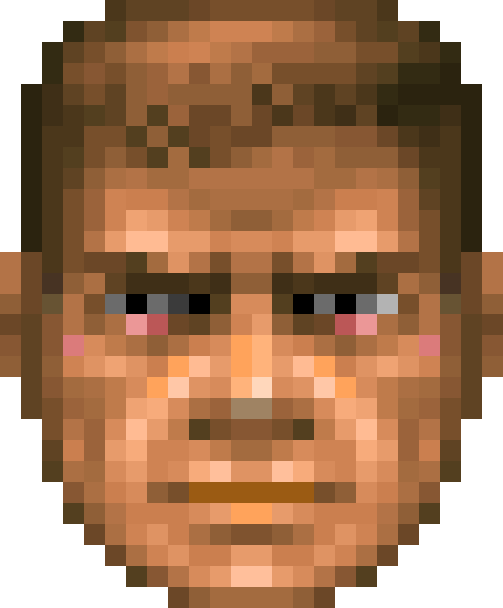
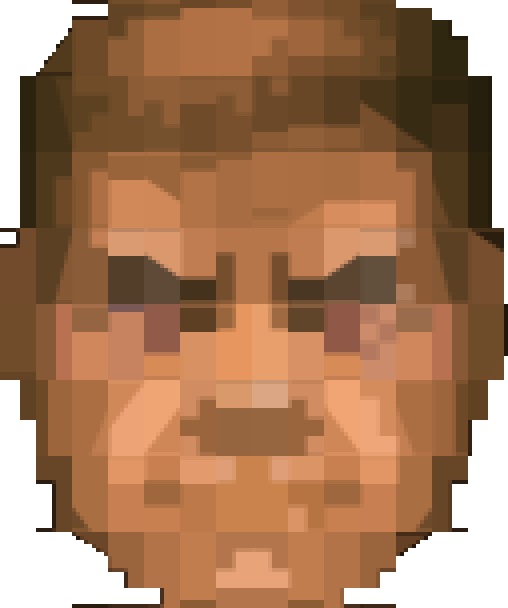

# Ideation: claude-doom-statusbar

## Grounding Context

**Topic shape:** Retro-gaming-themed status bar/HUD for Claude Code CLI. Maps coding session metrics to DOOM (1993) game elements. Terminal-based UI fed by Claude Code's JSON stdin API + 12 reactive lifecycle hooks (PreToolUse, PostToolUse, Stop, SessionStart, SubagentStop, etc.).

**Available metrics:** `context_window.used_percentage`, `rate_limits` (5hr/daily), `cost.total_cost_usd`, `model.display_name`, `vim.mode`, `lines_added/removed`

**Technical surface:**
- Braille Unicode gives ~4x effective pixel density for pixel art in terminal
- Chafa converts image sprites to static ANSI escape strings (bake at build time)
- Two integration surfaces: stdin polling (status line) + hooks (reactive events)

**Ecosystem:**
- Incumbent: `ccstatusline` (~10k ⭐, TypeScript/Bun) — data dashboard style, no gamification
- DOOM HUD: HP bar, ammo counter, Doomguy face (42 sprites), skull keys (6 variants: keycard + skull × 3 colors)
- Prior art: `rpg-cli` (filesystem → RPG combat), `RPGIT` (commits → XP), `doom-ascii` (full DOOM in terminal)

**Gaps identified:** No pixel art in Claude Code status bar. No health-depletion metaphor. No hook-driven animation. No "when to restart" signal.

---

## Visual Direction & Layout Vision

The status bar attaches **below the prompt line** and is divided into **segment boxes**. Each box owns one set of related parameters; the **mugshot (Doomguy face) sits in the center** as the emotional readout.

```
┌─ CONTEXT ────┐ ┌─ USAGE ──────┐   ╔══════════════╗   ┌─ CWD / GIT ──┐ ┌─ AGENTS ─────┐
│ HP ███████░ 78│ │ 5h  ▮▮▮▮▯  64%│   ║              ║   │ ~/proj ⎇ main │ │ ▶ 2 running  │
│ 31k / 200k tok│ │ day ▮▮▯▯▯  31%│   ║  ( mugshot ) ║   │ +124 / -37   │ │ explore,plan │
│ window: open  │ │ $1.83 session│   ║   scales to  ║   │ ● 3 changed  │ │ ··· geiger   │
│ ⚡ active      │ │ BFG equipped │   ║  tallest box ║   │ 🟥🟨 keys     │ │ ▒▒ depth     │
└───────────────┘ └──────────────┘   ╚══════════════╝   └──────────────┘ └──────────────┘
```

**Scaling rules:**
- Bar height is driven by the **tallest box** (number of parameters in its busiest segment).
- The mugshot **scales continuously** with that height — roughly **4 to 16 character rows** tall, with intermediate sizes in between (not a fixed set of steps).
- Boxes appear/disappear and grow/shrink with available metrics; the face re-sizes to match.

### Box styling (configurable)

Box framing is **chosen by the user at install time** from a single model, not from fixed themes. Two colours and one topology cover every look:

- `box.background` ∈ { terminal background, specific colour }
- `mugshot.background` ∈ { terminal background, specific colour } — independent of `box.background` (e.g. blue boxes, black mugshot)
- `border.color` ∈ { terminal background, terminal foreground, specific colour }
- `border.style` ∈ { `frame`, `vertical`, `none` }
- `headers` ∈ { shown, hidden } — whether each box shows a title row

The "variants" are just presets of this model:

| Preset | `box.background` | `border.color` | `border.style` | Cost |
|--------|------------------|----------------|----------------|------|
| **A** frame | terminal bg | gray | `frame` (title breaks the top line) | +2 rows |
| **B** lines | terminal bg | gray | `vertical` (separators only) | 0 rows |
| **C** panel | dark colour | terminal bg | `vertical` (solid panel, seamless cuts) | 0 rows |
| **C′** panel | dark colour | black | `vertical` (solid panel, black dividers) | 0 rows |
| **N** none | dark *or* terminal bg | — | `none` (no borders; boxes merge into one panel, or are separated only by spacing) | 0 rows |

Notes:
- A separator coloured as *terminal background* renders as a true gap — a hole punched through the panel to the terminal behind it — which is why preset **C**'s cuts are seamless against any colour scheme.
- A discarded "variant D" gave **each box its own background colour**. It is intentionally out of scope: a single terminal cell carries one background colour, so a divider between a blue box and a red box cannot be blue on one side and red on the other without a per-boundary half-block (`▌`) seam — more visual noise than the DOOM palette wants.
- The `none` style draws no borders at all. On a coloured `box.background` the boxes merge into one continuous panel (grouping comes from content and spacing); on a terminal background they are separated only by a blank gap. Cheapest and most minimal look.
- **Headers** are optional (configurable): each box may or may not show a title row.
- The **mugshot is never framed and never headed** — it is the visual centre, always bare, and always spans the full bar height. It absorbs whatever rows the sibling boxes spend on chrome: **+2 rows** in `frame` style (where the others have top and bottom borders) and **+1 row** when headers occupy their own row (`vertical` / `none`). The face is loaded at exactly that height (`doomguy_faces_ansi/<rows>/`).
- The **mugshot composites onto its own background**, not the box background. The face is baked from a *transparent* sprite (the magenta key turned transparent), so chafa encodes the surround as an unset colour rather than black; the renderer maps only that unset colour to `mugshot.background`, leaving any real black inside the face untouched. On a terminal (transparent) `mugshot.background`, silhouette cells whose transparent part falls in the glyph foreground are drawn with reverse video so the edge stays clean instead of showing a white fringe.
- This styling model is a natural fit for the declarative-segment / WAD skin system (Idea #3): a skin is just a chosen set of these colour/style values.

Prototype: `tools/mockup_boxes.py` renders the presets in 24-bit ANSI for side-by-side comparison.

### Mugshot rendering

The face is produced by **chafa** from the original DOOM sprite, using the symbol set **`block + half + quad + sextant + wedge + legacy`**. The `legacy` class (Unicode "Symbols for Legacy Computing" U+1FB00.. and its Supplement U+1CD00..) adds the most sub-cell detail, so the face stays readable even at small sizes.

Example at **8 character rows** — original sprite (left) and the actual chafa block-art mugshot (right), both at the same display height. Note how the right image is genuinely built from glyphs: half-blocks, quadrants, sextants/octants, and diagonal wedge cuts along the jaw and cheeks.

<p>
  
  &nbsp;&nbsp;➜&nbsp;&nbsp;
  
</p>

> **Rendering note.** In a terminal, chafa's legacy-computing glyphs are drawn by the terminal's *built-in* glyph rasteriser (e.g. Windows Terminal) — no font required. A static PNG bake cannot reuse that path: no common installed font covers U+1FB00.. / U+1CD00.. (a font bake yields empty boxes/tofu), and a font-free pixel resample loses the glyph texture entirely (it just looks like a shrunken photo). The block-art preview above is therefore a **screenshot of chafa's real terminal output** — the exact glyphs the live HUD uses — with the terminal background keyed transparent. The original sprite (left) is the source DOOM face with its magenta key colour made transparent.

---

## Ranked Ideas

### 1. Face-First Architecture
**Description:** Claude IS Doomguy. The 42-sprite face is the PRIMARY display — not decoration. Hook events drive narrative beats: `PreToolUse` = combat begins, `PostToolUse` = resolves, `Stop` = level end, error = pain sprite, clean completion = grin. Numbers are secondary legend. Face encodes full session state peripherally, without requiring direct attention.

**Warrant:** `direct:` — 42 DOOM face sprites (8 types × 5 health levels + dead + god) confirmed in DOOM source code (ST_NUMFACES); hooks fire discrete events with JSON payloads; no existing Claude Code tool uses face as primary readout. `external:` Sandy Petersen (id Software) documented that playtesting showed players ignored HP numbers under stress — the face was added specifically because it solved attention capture that numbers failed at.

**Rationale:** The same problem exists in dev tools. ccstatusline users glance at numbers; they don't react until they're in trouble. A peripheral emotional readout reacts for them. Reframing Claude=Doomguy makes pain and death semantically correct — Claude is the agent taking damage, not the user.

**Downsides:** Team must define all 42 face states in Claude terms. Braille pixel art for the face requires careful sprite sizing (~8x8 terminal cells minimum).

**Confidence:** 92% | **Complexity:** Medium | **Status:** Unexplored

---

### 2. Event-Driven-Only Architecture
**Description:** No polling. Hooks (PreToolUse, PostToolUse, Stop, SessionStart) + stdin form a single normalized event stream. HUD updates ONLY on hook events — frozen between tool calls. Third-party tools can inject HUD segments via a named pipe protocol (`{"segment": "ammo", "value": 42, "color": "yellow"}`). Any tool in the ecosystem (CI, git hooks, KARAT CLI) can push a segment without depending on doom-statusbar internals.

**Warrant:** `reasoned:` During AI inference, no metrics change — polling between events adds CPU + terminal flicker for zero information gain. Hooks are already event-driven; the architecture should follow the data. `external:` Named-pipe segment injection is a proven pattern (tmux, i3status-rs) for third-party extension without coupling.

**Rationale:** Eliminates the entire polling/refresh-rate engineering problem. Makes the HUD trivially simple: write to terminal on hook fire, do nothing otherwise. The "frozen" aesthetic between events is honest — nothing IS changing during inference. Third-party injection turns the HUD into a general terminal information surface.

**Downsides:** Requires discipline — no convenience polling timer. Some metrics (elapsed time) need to be derived from event timestamps rather than read continuously.

**Confidence:** 88% | **Complexity:** Medium | **Status:** Unexplored

---

### 3. WAD Extensibility Stack
**Description:** Three-layer extensibility system inspired by DOOM's WAD architecture. (1) **Chafa sprite compiler:** at build time, converts DOOM sprite sheets to static ANSI escape string constants — zero runtime dependencies, works anywhere Node/Bun runs. (2) **Declarative segment schema:** segments defined in TOML (metric source, thresholds, colors, icons, hide conditions) — adding a new metric requires editing one config file, no code. (3) **WAD override system:** community themes are directories of TOML + sprite overrides layered over the base config — one PR per skin, no fork needed.

**Warrant:** `external:` Starship prompt gained 2000+ community segments via declarative schema with no core maintainer involvement. DOOM's WAD patch-over-base mechanism sustained a modding community for 30 years. Both validate that lowering contribution friction from "understand the codebase" to "edit a config file" creates compounding community value.

**Rationale:** Every architectural investment here compounds: chafa bake eliminates a runtime dep that would gate all users; declarative schema means new Claude hook payload fields become available immediately; WAD system means the community builds skins the maintainer never imagined.

**Downsides:** Higher upfront investment. Declarative schema needs careful design to avoid becoming too rigid. WAD merge semantics need clear spec (which keys override, which merge).

**Confidence:** 85% | **Complexity:** Medium | **Status:** Unexplored

---

### 4. Session Memory System
**Description:** Three-part longitudinal system. (1) **SQLite telemetry:** every hook event writes to a local SQLite DB (tool name, timestamp, metric snapshot) — no network calls. (2) **Intermission screen:** on `Stop` hook, render a full-terminal DOOM-style intermission: kills (successful tool calls), secrets found (files touched), cost (par time vs actual), session type classified from lines_added/removed ratio. (3) **Dungeon automap:** `doom-statusbar map` renders historical sessions as a dungeon floor — rooms = sessions, corridors = tool call chains, revealed vs unexplored areas = explored vs untouched codepaths.

**Warrant:** `direct:` Stop, SessionStart hooks available with full JSON payloads; `lines_added/removed`, `cost.total_cost_usd` are live metrics. `external:` DOOM's intermission screen (documented on doomwiki.org) converts ephemeral gameplay into a structured debrief — same principle applied to dev sessions.

**Rationale:** Sessions end with no closure. The intermission screen converts ephemeral work into a memorable artifact. SQLite telemetry amortizes across every future feature — cost trend queries, anomaly detection, weekly reports — without new data collection. The dungeon automap makes long-project progress tangible.

**Downsides:** SQLite adds a disk-write on every hook event (performance concern for high-frequency tool call sessions). Historical dungeon map is complex to render meaningfully. Session classification heuristics may be wrong.

**Confidence:** 78% | **Complexity:** High | **Status:** Unexplored

---

### 5. Optimal Session Window
**Description:** Encode WHEN TO RESTART as a first-class HUD element — distinct from danger level. Sweet spot 30–70% context used = "BFG charged / sourdough at peak / pit window open." Displays a dedicated indicator (not the health bar) that opens green at 30%, peaks at 50%, and closes/blinks at 70%+. Above 85% = window closed, restart now. The insight: both too-early and too-late restarts are suboptimal; only the window encodes the optimum.

**Warrant:** `reasoned:` Context 30–70% is an LLM reasoning sweet spot (enough context loaded, not yet diluted). Three independent analogies converge on the same structure: BFG charge (charges to ready, then fires), sourdough fermentation (under-proofed / peak / over-proofed), F1 pit window (too-early and too-late are both suboptimal). `direct:` `context_window.used_percentage` is a live metric.

**Rationale:** Current tools ask "am I dying?" (danger threshold). This asks "when should I act?" (optimal timing). These are categorically different questions with different UX. The window metaphor communicates that the decision is time-sensitive and bidirectional, not just "don't cross this line."

**Downsides:** 30–70% thresholds are calibrated guesses; different tasks may have different sweet spots. Requires user education — the concept of an "optimal window" is non-obvious.

**Confidence:** 82% | **Complexity:** Low-Medium | **Status:** Unexplored

---

### 6. Geiger Counter Activity Rhythm
**Description:** Tool-call FREQUENCY (not cumulative state) as a click-rate signal. Dense PostToolUse bursts = rapid ASCII pulses in the status bar; idle inference = slow clicks or silence. Implemented as a rolling event counter over a 5-second window. Distinct visual pattern per activity level: `·` (idle), `··` (active), `···` (burst), `⚡` (cascade). Encodes "what is happening right now" — orthogonal to all other HUD metrics.

**Warrant:** `external:` Radiation dosimetry distinguishes cumulative dose from dose rate — a high dose rate at low total dose is more immediately dangerous than vice versa. The dual-register principle (cumulative state + current rate) applied to agentic session monitoring captures information that single-register tools miss. No existing Claude Code tool surfaces activity intensity as a distinct signal.

**Rationale:** All other HUD elements show WHAT the session state is (how full, how expensive, what model). The Geiger counter shows HOW ACTIVE the session is right now. This is the difference between a speedometer and an odometer — both useful, neither redundant.

**Downsides:** Rolling window size (5 seconds?) needs calibration. May be visually distracting during intensive cascade sessions. Not a DOOM-native element — requires design work to fit the aesthetic.

**Confidence:** 86% | **Complexity:** Low | **Status:** Unexplored

---

### 7. DOOM SFX Audio Layer
**Description:** Reactive WAV sounds on hook events via one-liner subprocess: `powershell -c (New-Object Media.SoundPlayer 'sfx\pistol.wav').PlaySync()` (Windows), `afplay sfx/pistol.wav` (macOS), `aplay sfx/pistol.wav` (Linux). Event mapping: `PreToolUse` → distant gunshot; `PostToolUse` success → shell casing clink; `PostToolUse` error → demon growl; rate-limit approach → boss music sting; `Stop` → level-complete fanfare. Visual bar stays minimal; sound carries ambient state. Opt-in; configurable per-event.

**Warrant:** `reasoned:` Audio bypasses the "eyes on code" problem entirely — a developer deep in an editor never needs to glance at the status bar. Technically feasible on all three platforms from hook shell scripts with zero additional dependencies. DOOM was equally defined by its audio (Bobby Prince) as its visuals — the aesthetic is incomplete without it.

**Rationale:** The most-watched UI element is the one you never need to watch. Audio ambient signals extend the HUD's reach to all focused states, not just when the terminal is visible. The distinctive DOOM audio vocabulary (specific sounds for specific events) is immediately recognizable and emotionally resonant for the target audience.

**Downsides:** Opt-in required — default off for office/shared environments. Synchronous `PlaySync()` on Windows may introduce brief latency on hook execution. Original DOOM WAV assets have copyright considerations — need CC-licensed or custom-recorded alternatives.

**Confidence:** 80% | **Complexity:** Low | **Status:** Unexplored

---

## Rejection Summary

| # | Idea | Reason Rejected |
|---|------|-----------------|
| 1–3, 5, 8 | HP bar, ammo, weapon slot, skull keys (baseline) | Absorbed into Survivor 1 (Face-First Architecture) as implied HUD baseline |
| 4 | Cost Bleed Gauge | Duplicates HP+ammo metaphor; weaker framing |
| 6 | Kill Counter (lines ratio) | Less novel than Geiger counter for the same data source |
| 7 | Vim Automap | Too niche (Vim-only), not universal enough for default HUD |
| 9 | Session Graph as Floor Plan | Floor plan in 1-2 terminal lines infeasible |
| 10 | Auto-Throttle Face | Scope creep into automation; outside status bar scope |
| 11 | Skull Keys from SessionStart | Duplicate of skull-key baseline |
| 12 | Per-Tool Ammo + Auto-Substitution | Too complex; moves beyond display |
| 14 | Chainsaw Mode | Useful audit hook but out of scope for status bar |
| 16 | Pain Palette (ambient color) | Less DOOM-authentic than face-first approach |
| 17 | Bar Watches Developer | Cursor tracking not available via Claude Code hooks |
| 18 | Cost Is a Wound | Conflicts with context=HP design choice; can't map both |
| 20 | Hooks as Narrative Engine | Framing/philosophy, absorbed into Survivor 1 |
| 21, 45 | Arena Scoreboard / Multiplayer | Server infrastructure; out of scope |
| 22 | Boss Health Bar (modal) | Absorbed into Survivor 1 hook-narrative beats |
| 24 | Bar as Input Surface | Claude Code status line is stdin-only (read-only) |
| 28 | Permission Key Cards | Duplicate of skull-key baseline |
| 33 | Altimeter Named Regimes | Insight absorbed into Survivor 5 (Optimal Window) |
| 34 | OR Vital Signs | Multi-channel hard in 1-2 lines; principle absorbed into Survivor 2 architecture |
| 37 | Ship Trim | Less DOOM-authentic than Geiger counter for same data |
| 40 | Clinical Fluid Balance | Novel ("low cost=warning") but edge-case; v2 candidate |
| 41 | Full-Terminal Takeover | Duplicate of Boss Health Bar |
| 42 | Zero-Metric Aesthetics | Too minimal for useful tool |
| 43 | Metric Overload | Research instrument, not product feature |
| 46 | Rogue-Like Instead of DOOM | Subject replacement — rejected |
| 47 | Floating Desktop Widget | Natural v2 extension; out of scope for v1 |
