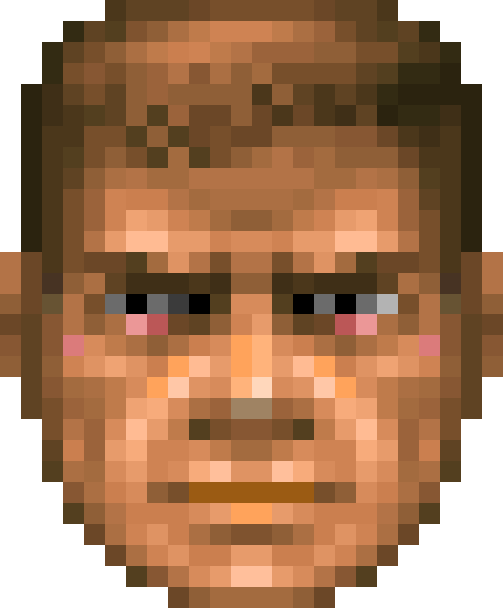

# Ideation: claude-doom-statusbar

## Grounding Context

**Topic shape:** Retro-gaming-themed status bar/HUD for Claude Code CLI. Maps coding session metrics to DOOM (1993) game elements. Terminal-based UI fed by Claude Code's JSON stdin API + 12 reactive lifecycle hooks (PreToolUse, PostToolUse, Stop, SessionStart, SubagentStop, etc.).

**Available metrics:** `context_window.used_percentage`, `rate_limits` (5hr/daily), `cost.total_cost_usd`, `model.display_name`, `vim.mode`, `lines_added/removed`

**Technical surface:**
- Braille Unicode gives ~4x effective pixel density for pixel art in terminal
- Chafa converts image sprites to static ANSI escape strings (bake at build time)
- Two integration surfaces: stdin polling (status line) + hooks (reactive events)

**Ecosystem:**
- Incumbent: `ccstatusline` (~10k ⭐, TypeScript/Bun) — data dashboard style, no gamification
- Also relevant: `claude-hud` — another Claude Code status/HUD project worth drawing inspiration from
- DOOM HUD: HP bar, ammo counter, Doomguy face (42 sprites), skull keys (6 variants: keycard + skull × 3 colors)
- Prior art: `rpg-cli` (filesystem → RPG combat), `RPGIT` (commits → XP), `doom-ascii` (full DOOM in terminal)

**Gaps identified:** No pixel art in Claude Code status bar. No health-depletion metaphor. No hook-driven animation. No "when to restart" signal.

---

## Visual Direction & Layout Vision

The status bar attaches **below the prompt line** and is divided into **segment boxes**. Each box owns one set of related parameters; the **mugshot (Doomguy face) sits in the center** as the emotional readout.

```
┌─ CONTEXT ────┐ ┌─ USAGE ──────┐   ╔══════════════╗   ┌─ CWD / GIT ──┐ ┌─ AGENTS ─────┐
│ HP ███████░ 78│ │ 5h  ▮▮▮▮▯  64%│   ║              ║   │ ~/proj ⎇ main │ │ ▶ 2 running  │
│ 31k / 200k tok│ │ day ▮▮▯▯▯  31%│   ║  ( mugshot ) ║   │ +124 / -37   │ │ explore,plan │
│ window: open  │ │ $1.83 session│   ║   scales to  ║   │ ● 3 changed  │ │ ··· geiger   │
│ ⚡ active      │ │ BFG equipped │   ║  tallest box ║   │ 🟥🟨 keys     │ │ ▒▒ depth     │
└───────────────┘ └──────────────┘   ╚══════════════╝   └──────────────┘ └──────────────┘
```

**Scaling rules:**
- Bar height is driven by the **tallest box** (number of parameters in its busiest segment).
- The mugshot **scales continuously** with that height — roughly **4 to 16 character rows** tall, with intermediate sizes in between (not a fixed set of steps).
- Boxes appear/disappear and grow/shrink with available metrics; the face re-sizes to match.
- **Width is responsive.** Each box (and each metric) has a **minimum and maximum width**. As the terminal narrows, boxes shrink toward their min (bars contract — e.g. 14 → 4 cells); on ultra-wide screens they never grow past their max, so information stays compact and readable instead of stretched. A box takes the width of its widest metric; bars fill the box width within those bounds.

### Box styling (configurable)

Box framing is **chosen by the user at install time** from a single model, not from fixed themes. Two colours and one topology cover every look:

- `box.background` ∈ { terminal background, specific colour }
- `mugshot.background` ∈ { terminal background, specific colour } — independent of `box.background` (e.g. blue boxes, black mugshot)
- `border.color` ∈ { terminal background, terminal foreground, specific colour }
- `border.style` ∈ { `frame`, `vertical`, `none` }
- `headers` ∈ { shown, hidden } — whether each box shows a title row

The "variants" are just presets of this model:

| Preset | `box.background` | `border.color` | `border.style` | Cost |
|--------|------------------|----------------|----------------|------|
| **A** frame | terminal bg | gray | `frame` (title breaks the top line) | +2 rows |
| **B** lines | terminal bg | gray | `vertical` (separators only) | 0 rows |
| **C** panel | dark colour | terminal bg | `vertical` (solid panel, seamless cuts) | 0 rows |
| **C′** panel | dark colour | black | `vertical` (solid panel, black dividers) | 0 rows |
| **N** none | dark *or* terminal bg | — | `none` (no borders; boxes merge into one panel, or are separated only by spacing) | 0 rows |

Notes:
- A separator coloured as *terminal background* renders as a true gap — a hole punched through the panel to the terminal behind it — which is why preset **C**'s cuts are seamless against any colour scheme.
- A discarded "variant D" gave **each box its own background colour**. It is intentionally out of scope: a single terminal cell carries one background colour, so a divider between a blue box and a red box cannot be blue on one side and red on the other without a per-boundary half-block (`▌`) seam — more visual noise than the DOOM palette wants.
- The `none` style draws no borders at all. On a coloured `box.background` the boxes merge into one continuous panel (grouping comes from content and spacing); on a terminal background they are separated only by a blank gap. Cheapest and most minimal look.
- **Headers** are optional (configurable): each box may or may not show a title row.
- The **mugshot is never framed and never headed** — it is the visual centre, always bare, and always spans the full bar height. It absorbs whatever rows the sibling boxes spend on chrome: **+2 rows** in `frame` style (where the others have top and bottom borders) and **+1 row** when headers occupy their own row (`vertical` / `none`). The face is loaded at exactly that height (`assets/images/mugshot/ans/<rows>/`).
- The **mugshot composites onto its own background**, not the box background. The face is baked from a *transparent* sprite (extracted from the WAD with real alpha), so chafa encodes the surround as an unset colour rather than black; the renderer maps only that unset colour to `mugshot.background`, leaving any real black inside the face untouched. On a terminal (transparent) `mugshot.background`, silhouette cells whose transparent part falls in the glyph foreground are drawn with reverse video so the edge stays clean instead of showing a white fringe.
- This styling model is a natural fit for the declarative-segment / WAD skin system (Idea #3): a skin is just a chosen set of these colour/style values.

Prototype: `tools/mockup_boxes.py` renders the presets in 24-bit ANSI for side-by-side comparison.

### Mugshot rendering

The face is produced by **chafa** from the original DOOM sprite, using the symbol set **`block + half + quad + sextant + wedge + legacy`**. The `legacy` class (Unicode "Symbols for Legacy Computing" U+1FB00.. and its Supplement U+1CD00..) adds the most sub-cell detail, so the face stays readable even at small sizes.

Example at **8 character rows** — original sprite (left) and the actual chafa block-art mugshot (right), both at the same display height. Note how the right image is genuinely built from glyphs: half-blocks, quadrants, sextants/octants, and diagonal wedge cuts along the jaw and cheeks.

<p>
  
  &nbsp;&nbsp;➜&nbsp;&nbsp;
  
</p>

> **Rendering note.** In a terminal, chafa's legacy-computing glyphs are drawn by the terminal's *built-in* glyph rasteriser (e.g. Windows Terminal) — no font required. A static PNG bake cannot reuse that path: no common installed font covers U+1FB00.. / U+1CD00.. (a font bake yields empty boxes/tofu), and a font-free pixel resample loses the glyph texture entirely (it just looks like a shrunken photo). The block-art preview above is therefore a **screenshot of chafa's real terminal output** — the exact glyphs the live HUD uses — with the terminal background keyed transparent. The original sprite (left) is the source DOOM face extracted from `DOOM1.WAD` (`assets/images/mugshot/wad/`), with real alpha transparency.

---

## Mugshot — Face States (42)

The face is "Claude as Doomguy" (Idea #1). DOOM's 42 sprites are **8 expressions × 5 health levels + god + dead**. Two independent axes drive the choice: a **health level** (which of 5 rows) and an **expression** (which of 8, plus the two specials).

**Health level** — driven by **usage headroom**, not context. The HP value is:

```
HP = min(remaining_5h, remaining_7d) / total_5h
```

— the tightest of the 5-hour and weekly budgets, normalised to a full 5-hour clip. It expresses *how much usage is left before the binding rate limit* (lower = closer to running out → more hurt). `hp_thresholds` (default `[20, 40, 60, 80]`, %) cut it into the five rows; **higher headroom = healthier**.

| HP row | headroom | look |
|--------|----------|------|
| 0 (best) | > 80 % | fresh, composed |
| 1 | 60–80 % | fine |
| 2 | 40–60 % | working, tense |
| 3 | 20–40 % | battered |
| 4 (worst) | 1–20 % | bloodied, near the limit |

`remaining_x = 100 − rate_limits.x.used_percentage`; with only percentage data the two remainings are each relative to their own window and `/ total_5h` normalises to one 5-hour clip (so the value can read as "5-hour-clips of headroom left", capped healthy when plenty remains). **Fallback:** `rate_limits` is Claude.ai-only — on API-key deployments without it, HP falls back to context headroom (`100 − context_window.used_percentage`).

**Expression** — a transient reaction chosen by session events; decays back to the idle/look faces. Priority high→low:

| Expr | Meaning | Trigger (provider) |
|------|---------|--------------------|
| `ouch` | took a hit / blocked | `PostToolUseFailure` · `StopFailure` · `PermissionDenied` |
| `kill` | rampage / focused fire | **every** write-class `PostToolUse` — `Edit`/`Write`/`MultiEdit`/`NotebookEdit`/`Bash` |
| `evl` | evil grin / power-up | **every** clean `Stop` (turn finished); also `TaskCompleted`, permission granted |
| `tl` / `tr` | looking around (scanning) | read-class `PostToolUse` — `Read`/`Grep`/`Glob`; alternate L/R |
| `st0`/`st1`/`st2` | forward idle | no recent event; cycles slowly |

> **lean-ctx tools** map the same way by base name: `ctx_read`/`ctx_multi_read`/`ctx_search`/`ctx_semantic_search`/`ctx_tree` → `tl`/`tr` (scanning); `ctx_shell`/`ctx_edit` → `kill` (action). MCP tool names arrive as `mcp__lean-ctx__ctx_*`; the hook strips the prefix.

**Specials** (override both axes):

| State | Meaning | Trigger |
|-------|---------|---------|
| `god` | invulnerable | **while the advisor tool runs** — `PreToolUse(advisor)` sets a sticky `god_since`, cleared on its `PostToolUse` (safety TTL ~180 s); also conceptually `permission_mode == bypassPermissions` |
| `dead` | out of headroom | context effectively exhausted (used → 100 %) or `SessionEnd` |

**Resolution order:** `dead` > `god` > `ouch` > `kill` > `evl` > `tl`/`tr` > idle. The HP row picks the sprite row; the expression picks the column within it. Transient expressions show briefly (≈1–2 s or until the next event), then relax to look/idle — this needs the event-driven layer (Idea #2) plus a short decay timer.

**Liveness (idle animation).** Even when nothing happens, the idle face glances around — it re-rolls the three forward frames (`st0`/`st1`/`st2`) about every 2 s. This requires the bar to redraw *while idle*, so set `refreshInterval` (min 1 s) in `settings.json`: Claude Code then re-runs the status line on a timer (event-driven updates are otherwise silent during idle). **No daemon is needed** — the frame is chosen **statelessly from the wall clock** (`bucket = floor(epoch / 2)`, pseudo-random pick), so every independent re-invocation lands on the right frame. Repeats are allowed (DOOM holds a frame too). *Demo: `tools/face_idle_live.py`.*

**Reactions need persisted state.** A reactive expression (`ouch`/`evl`/`kill`) can't be derived from the clock — it comes from an event the render pass didn't witness. The event-driven layer (Idea #2) bridges this: a hook writes the event + timestamp to a small state file; each status-line render reads it and shows that expression until it **decays** (age > ~1–2 s), then falls back to the idle/HP face. So idle is stateless (clock), reactions are stateful (event marker + decay).

Concrete protocol (`hooks/mugshot_hook.py` is an event-bus; `statusline.py` reads it):
- **State file** (`$MUGSHOT_STATE`, default `<temp>/mugshot_<session_id>.json`), written atomically on every event:
  ```json
  { "expr": "ouch", "ts": 0,
    "tools": [<epochs>], "agents": ["explore"], "tasks": {"created": 2, "completed": 1}, "errors": 1 }
  ```
- **Face mapping:** `PostToolUseFailure`/`StopFailure`/`PermissionDenied` → `ouch`; `Stop`/`TaskCompleted` → `evl`; `PostToolUse` → `kill` (write-class) or `tl`/`tr` (read-class). Read with a `reaction_decay` window (default 1.5 s).
- **Activity (hook-bus) → `act.*`:** `PostToolUse` appends a timestamp to `tools` (pruned to a 30 s window) → `act.geiger` sparkline; `SubagentStart/Stop` maintain `agents` → `act.agents`; `TaskCreated/Completed` → `act.tasks`; failures increment `errors` → `act.errors`. Absent keys hide their metric, so the FIGHT box lights up only once events have flowed.
- **Wiring:** map face events + `SubagentStart/Stop`, `TaskCreated/Completed` to the hook. The hook always exits 0; the hook process and the render process are fully decoupled via the file.

> Sprite/file names (e.g. `STFST01`) are not yet fixed — naming is deferred. The mapping above is the contract; assets are wired to it later.

---

## Metrics & Box Composition

There is a large **catalog of metrics**, grouped into **categories**. The user's configuration defines **which boxes exist and which metrics each box shows** — categories only organise the picker; any metric can go in any box. The mugshot is the fixed centre and is not a metric.

A metric is defined by: `id`, `category`, `label`, **provider** (where the value comes from), value type/format, an optional **DOOM mapping**, and an **availability** condition (so a box hides gracefully when its source is absent — see the WAD hide-conditions in Idea #3).

### Providers

- **statusline-json** — fields from the Claude Code status line JSON on stdin; refreshed every render.
- **hook-bus** — values accumulated from lifecycle hook events (counts, last event, running subagents/tasks, errors). Requires the event-driven layer (Idea #2).
- **shell** — derived by running a command in the status line script (e.g. git).
- **external** — metrics from outside Claude Code (OS/system or third-party): RAM, CPU, disk, battery, clock. **Pluggable:** a provider is a user-defined shell command → value; several ship by default (RAM, CPU, clock). **Cost note:** each external read is a subprocess per refresh — cache/throttle them.

> Field paths below reflect the current Claude Code status line JSON and hook payloads. Some are **conditional** (present only on Claude.ai subscriptions, certain models, or after the first API call) — flagged in *Availability*.

### Metric rendering

How a metric *looks* is configurable and independent of what it measures. The DOOM aesthetic is a set of render choices, not a fixed mapping.

**Value types**
- **text** — strings (cwd, branch, model name); optional truncation.
- **numeric** — numbers, with a choice of render style.

**Render styles** (numeric)
- `number` — `78%`, `$1.83`, `1.2k` (optional unit / precision)
- `bar` — progress bar: `█████▓░ 78%`
- `ammo` — segmented gauge: `▮▮▮▮▯ 64%`
- `spark` — sparkline over time: `▁▂▃▅▇▆▃` (for time-varying metrics; needs a rolling history buffer)

**Colour** — each metric has a colour; numeric metrics may use **threshold colours** (e.g. the context bar green → amber → red as it fills). Same colour model as boxes/borders.

**Headers / labels** — a box header (or a per-metric label) is **text** (`CONTEXT`) or a **unicode icon** (`🧠` context, `🕔` 5-hour, `📅` weekly, `🌿` branch, `💰` cost). Icons keep boxes narrow.

**Grouping (side by side)** — related metrics can share one line: git `🌿 main  ↓2 ↑3`, edits `+124 -37`, limits `🕔 64%  📅 31%`.

**DOOM flavour, à la carte** — the mugshot is the centrepiece; `ammo` style + a clip icon gives the ammo feel; a threshold `bar` gives the HP feel; permission icons give skull keys. Opt into as much or as little DOOM as you like.

**Time-series & maps (exploratory)** — a metric that varies over time can render as a **`spark`line** (`▁▂▃▅▇`) built from a rolling history buffer (hook-bus). Good candidates: context growth, `rate.cost_min`, `rate.tok_s`, `act.geiger`, edits/min. Going further, a **character mini-map** is feasible (a braille canvas gives ~4× pixel density). Candidate uses — a session **automap** (tool-call chain as corridors, files touched as rooms — ties to Idea #4), a context-depth map, or a task-progress map. The use is still open; parked as a v2 exploration.

> The *DOOM* column in the catalog below is illustrative flavour only — actual presentation is the configurable render style / colour / icon described here.

### Catalog

**Vitals — context** (provider: statusline-json)

| Metric | Source | Format | DOOM | Availability |
|--------|--------|--------|------|--------------|
| context.hp | `context_window.used_percentage` | 0–100 % | **Health (HP)** | always |
| context.remaining | `context_window.remaining_percentage` | 0–100 % | HP remaining | always |
| context.tokens | `context_window.total_input_tokens` / `total_output_tokens` | tokens | — | always |
| context.window | `context_window.context_window_size` | 200k / 1M | — | always |
| context.cache | `context_window.current_usage.cache_read_input_tokens` … | tokens | — | null before 1st call / after compact |
| context.over200k | `exceeds_200k_tokens` | bool | danger flag | always |

**Ammo — rate limits** (provider: statusline-json)

| Metric | Source | Format | DOOM | Availability |
|--------|--------|--------|------|--------------|
| ratelimit.5h | `rate_limits.five_hour.used_percentage` | 0–100 % | **Ammo (5h clip)** | Claude.ai only, after 1st response |
| ratelimit.5h.reset | `rate_limits.five_hour.resets_at` | epoch → countdown | reload timer | Claude.ai only |
| ratelimit.7d | `rate_limits.seven_day.used_percentage` | 0–100 % | **Ammo (weekly)** | Claude.ai only |
| ratelimit.7d.reset | `rate_limits.seven_day.resets_at` | epoch → countdown | reload timer | Claude.ai only |

**Loadout — model & reasoning** (provider: statusline-json)

| Metric | Source | Format | DOOM | Availability |
|--------|--------|--------|------|--------------|
| model.name | `model.display_name` | text | **Weapon equipped** | always |
| effort.level | `effort.level` | low…max | weapon mod | model-dependent |
| thinking.on | `thinking.enabled` | bool | scope/zoom | when present |
| output.style | `output_style.name` | text | — | always |
| vim.mode | `vim.mode` | NORMAL/INSERT/… | — | vim mode on |

**Economy — cost & output** (provider: statusline-json, some derived)

| Metric | Source | Format | DOOM | Availability |
|--------|--------|--------|------|--------------|
| cost.total | `cost.total_cost_usd` | USD | score | always (estimate) |
| time.elapsed | `cost.total_duration_ms` | duration | par time | always |
| time.api | `cost.total_api_duration_ms` | duration | — | always |
| edits.added / removed | `cost.total_lines_added` / `total_lines_removed` | counts | frags/spawns | always |
| rate.cost_min | derived: cost / minutes | USD/min | bleed rate | derived |
| rate.tok_s | derived: out tokens / api seconds | tok/s | fire rate | derived |

**Location — workspace, git, PR**

| Metric | Source | Provider | DOOM | Availability |
|--------|--------|----------|------|--------------|
| loc.cwd | `cwd` / `workspace.current_dir` | statusline-json | level name | always |
| loc.project | `workspace.project_dir` | statusline-json | — | always |
| loc.repo | `workspace.repo.owner` / `name` / `host` | statusline-json | — | in git repo |
| git.branch | `git branch --show-current` | shell | — | derived |
| git.status | `git status --porcelain` (counts) | shell | — | derived |
| git.ahead / git.behind | `git rev-list --count @{u}..` / `..@{u}` | shell | side-by-side `↓2 ↑3` | derived |
| loc.worktree | `worktree.name` / `workspace.git_worktree` | statusline-json | — | in worktree |
| pr.state | `pr.number` / `pr.review_state` | statusline-json | — | when PR found |

**Activity — hooks** (provider: hook-bus)

| Metric | Source | Format | DOOM | Availability |
|--------|--------|--------|------|--------------|
| act.geiger | PostToolUse frequency (rolling window) | rate glyphs | **activity click-rate** (Idea #6) | event layer |
| act.last_tool | last `PreToolUse.tool_name` | text | current action | event layer |
| act.agents | SubagentStart − SubagentStop | count | active demons | event layer |
| act.tasks | TaskCreated / TaskCompleted | n/m | objectives | event layer |
| act.errors | PostToolUseFailure / StopFailure count | count | pain hits | event layer |
| act.compactions | PreCompact / PostCompact | count + tokens freed | — | event layer |

**Access — permissions / keys** (provider: statusline-json + hook-bus)

| Metric | Source | Format | DOOM | Availability |
|--------|--------|--------|------|--------------|
| perm.mode | `permission_mode` (hook common field) | text | — | event layer |
| perm.keys | granted tool classes (bash/write/MCP) | icons | **Skull keys** (3 colours) | derived |

**Session — meta** (provider: statusline-json)

| Metric | Source | Format | DOOM | Availability |
|--------|--------|--------|------|--------------|
| sess.name | `session_name` | text | — | if named |
| sess.id | `session_id` | text | — | always |
| app.version | `version` | text | — | always |
| agent.name | `agent.name` | text | — | with `--agent` |

**System / External — off Claude Code** (provider: external/shell)

| Metric | Source | Format | DOOM | Availability |
|--------|--------|--------|------|--------------|
| sys.ram | OS (e.g. used / total MB) | % or MB | **Armor** | external (subprocess) |
| sys.cpu | OS load / % | % | engine heat | external |
| sys.disk | free space on cwd volume | % or GB | — | external |
| sys.battery | OS battery level | % | — | external (laptops) |
| sys.net | up/down or online state | text | — | external |
| sys.clock | wall-clock time | HH:MM | — | external |

### Additional metrics from prior art

Cross-checked against **ccstatusline** (sirmalloc) and **claude-hud** (jarrodwatts). Metrics they expose that extend the catalog. Provenance is honest: several are *derived* or *source-uncertain* (the projects obtain them from the transcript, config, env, or undocumented fields), flagged below.

| Metric | From | Provider / source | Note |
|--------|------|-------------------|------|
| context.usable_pct | ccstatusline | derived | % of *usable* window (excl. reserved/system), distinct from raw used % |
| context.autocompact_pct | claude-hud | derived + config | % against a configurable sub-window → graduated warning instead of the binary `exceeds_200k` |
| cache.ttl_countdown | claude-hud | derived | countdown to prompt-cache expiry (TTL 300 s; 3600 s on Max) |
| rate.tok_in_s / rate.tok_out_s | ccstatusline | derived | input- and output-speed split (we had total only) |
| ratelimit.weekly.sonnet / .opus | ccstatusline | statusline-json? / derived (uncertain) | per-model weekly usage (limits are model-specific on some plans) |
| usage.overage.util / .remaining | ccstatusline | derived (uncertain) | post-limit overage utilisation + remaining credit |
| git.conflicts | ccstatusline | shell | merge-conflict file count |
| git.sha | ccstatusline | shell | short commit hash |
| git.clean | ccstatusline | shell | clean/dirty flag |
| git.is_fork / git.upstream_owner | ccstatusline | statusline-json `repo` / shell | fork flag, upstream owner (vs origin) |
| cfg.counts | claude-hud | hook-bus (`InstructionsLoaded`/`ConfigChange`) / shell | CLAUDE.md · rules · MCP · hooks counts (config health) |
| act.idle | claude-hud | hook-bus | time since last assistant response (idle / latency) |
| sess.start | claude-hud | derived | absolute session-start timestamp |
| model.provider | claude-hud | env / derived | Bedrock / Vertex / direct |
| advisor.model | claude-hud | uncertain | active `/advisor` model name |
| term.width | ccstatusline | shell/env | terminal columns (layout decisions) |
| sess.account_email | ccstatusline | uncertain | logged-in account email |
| voice.status | ccstatusline | uncertain | voice input on/off |
| custom.cmd | ccstatusline | shell | arbitrary shell-command output as a metric (generic) |

**Computation patterns worth adopting:**
- **Auto-compact window** (claude-hud): compute context % against a configurable lower bound (e.g. 150k), turning the binary 200k flag into a graduated warning. *Highest-value adoption.*
- **Block timer from transcript** (ccstatusline): derive the 5-hour window boundary from the first message timestamp in the transcript JSONL, not wall-clock — aligns with how the window is actually measured.
- **Prompt-cache countdown** (claude-hud): surface the cache TTL as a live countdown (Max = 1 h vs standard 5 min).
- **Per-model weekly breakdown** (ccstatusline): track weekly Sonnet/Opus separately, not just aggregate 7-day.
- **Shared usage file** (claude-hud `externalUsagePath`): a file other tools (e.g. ccusage) read/write — a coordination hook if the bar must coexist with other usage tools.

### Box composition (configuration)

Boxes are user-defined and reference catalog ids. Styling per box uses the model from *Visual Direction*. Sketch:

```toml
[[box]]                                  # left
header = "🧠"                            # icon OR text
metrics = [
  { id = "context.hp",     render = "bar",    color = "threshold" },   # █████▓░ 78%
  { id = "context.tokens", render = "number", unit  = "tok" },
]

[[box]]
header = "AMMO"
metrics = [
  { id = "ratelimit.5h", render = "ammo", icon = "🕔" },               # 🕔 ▮▮▮▮▯ 64%
  { id = "ratelimit.7d", render = "ammo", icon = "📅" },
]

# mugshot — implicit centre, not a box of metrics

[[box]]                                  # right
header = "🌿"
metrics = [
  { id = "git.branch", render = "text" },
  { group = ["git.behind", "git.ahead"], render = "number", sep = " " },  # ↓2 ↑3
]

[[box]]
header = "SYS"
metrics = [
  { id = "sys.ram",   render = "bar",    color = "threshold" },
  { id = "sys.clock", render = "text",   icon  = "🕓" },
]
```

- A metric whose *Availability* fails (e.g. `ratelimit.*` on an API-key deployment) hides itself; an emptied box collapses. This keeps one config portable across Claude.ai / API / CI.
- Categories drive the **config picker** grouping only; the user is free to mix any metrics in any box.

---

## Configuration Schema

One TOML file describes the whole bar. It is **layered**: a built-in base, then the user's config, then any **skin** overlays (the WAD idea, #3) — later layers override earlier keys. Everything the mockups show is expressible here; the earlier "Box composition" sketch was a preview of this.

### `[bar]` — global defaults (any box may override)

```toml
[bar]
refresh_interval    = 1            # seconds; re-runs the bar while idle so the
                                   # face can animate (settings.json; min 1)
border_style        = "vertical"   # frame | vertical | none
border_color        = "term-bg"    # term-bg | term-fg | "#rrggbb"
box_background      = "term-bg"    # term-bg | "#rrggbb"
headers             = true         # show each box's title row
terminal_background = "term-bg"    # used for the empty-bar-track blend; or "#000000"
```

### `[mugshot]` — the centre face (independent background)

```toml
[mugshot]
background     = "#000000"         # term-bg | "#rrggbb"  (independent of boxes)
# HP value = min(remaining_5h, remaining_7d) / total_5h  (usage headroom);
# hp_thresholds are the % cut points between the 5 rows (higher = healthier).
hp_thresholds  = [20, 40, 60, 80]
hp_fallback    = "context"         # when rate_limits is absent (API-key deployments)
idle_cycle     = 2.0               # seconds between idle glances (st0/1/2)
reaction_decay = 1.5               # seconds a reaction holds before relaxing
```

The 42-sprite face logic (HP row × expression, god/dead, resolution order) is built in; only these knobs are exposed.

### `[[segment]]` — ordered left → right; the mugshot sits inline

Each segment is a `box` or the `mugshot`. Order in the file is the on-screen order.

```toml
[[segment]]                        # type "box": a titled group of metrics
type      = "box"
title     = "USAGE"                # text title (shown when headers = true)
min_width = 10                     # responsive floor
max_width = 22                     # responsive cap (no stretch past this)
# overrides of [bar] defaults are allowed here: box_background, border_*, headers
metric = [
  { id = "context.hp",   render = "bar", icon = "🧠", color = "threshold" },
  { id = "ratelimit.5h", render = "bar", icon = "🕔", color = "threshold" },
  { id = "ratelimit.7d", render = "bar", icon = "📅", color = "threshold" },
]

[[segment]]
type = "mugshot"                   # the centre face; no title, no border

[[segment]]
type  = "box"
title = "GIT"
metric = [
  { id = "git.branch", render = "text",   icon = "🌿" },
  { group = ["git.behind", "git.ahead"], render = "number", sep = " ", icon = "⇅" },
  { id = "git.status", render = "number", icon = "✎" },
]

[[segment]]
type  = "box"
title = "SYS"
metric = [
  { id = "sys.ram",   render = "bar",    icon = "💾", color = "threshold" },
  { id = "sys.cpu",   render = "number", icon = "🔥" },
  { id = "sys.clock", render = "text",   icon = "🕓" },
]
```

**Metric entry fields:**

| Field | Meaning |
|-------|---------|
| `id` | a catalog metric id (e.g. `context.hp`) |
| `group` | a list of ids rendered side by side (instead of `id`), e.g. ahead/behind |
| `render` | `text` · `number` · `bar` · `ammo` · `spark` |
| `icon` | unicode icon label (e.g. `🧠`); or `label = "TXT"` for a text label |
| `color` | `threshold` (value-driven green→amber→red) · `term-fg` · `"#rrggbb"` · theme name |
| `unit` / `precision` | for `number` (e.g. `unit = "tok"`) |
| `sep` | separator string for `group` |
| `min` / `max` | optional per-metric width bounds (box width = widest metric, within box min/max) |

### `[theme]` — named colours (one place for skins to override)

```toml
[theme]
threshold_ok   = "#60c868"   # bar fill < 60 %
threshold_warn = "#e0b840"   # 60–85 %
threshold_crit = "#e05440"   # > 85 %
title          = "#dec880"
text           = "#b6bac8"
```

### Behaviour notes

- **Inheritance:** a box inherits `[bar]` defaults; any key set on the box wins.
- **Availability:** a metric whose catalog *availability* fails (e.g. `ratelimit.*` on an API-key deployment) hides itself; an emptied box collapses. One config stays portable across Claude.ai / API / CI.
- **Responsive width:** boxes shrink toward `min_width` and never exceed `max_width`; bars fill the box within those bounds (see *Visual Direction*).
- **Skins (WAD):** a skin is just another TOML layer setting `[theme]`, backgrounds, borders, or icons — no fork needed.

---

## Default Presets

Three presets ship out of the box — instances of the schema above. They also span the styling range (none / vertical / panel). The bar height follows the tallest box, with a **floor of 4 rows** (the mugshot's minimum size), so short boxes simply pad to the face.

### `minimal` — blends into the terminal, smallest footprint

Borderless, no headers, transparent backgrounds; just the essentials beside a small face.

```toml
[bar]
border_style   = "none"
box_background = "term-bg"
headers        = false
[mugshot]
background = "term-bg"

[[segment]]
type = "box"
metric = [
  { id = "context.hp",   render = "bar",    icon = "🧠", color = "threshold" },
  { id = "ratelimit.5h", render = "ammo",   icon = "🕔" },
  { id = "cost.total",   render = "number", icon = "💰" },
]

[[segment]]
type = "mugshot"
```

### `default` — balanced (the live-mockup look)

Vertical separators, headers on, black mugshot on a terminal-background bar.

```toml
[bar]
border_style   = "vertical"
border_color   = "term-fg"
box_background = "term-bg"
headers        = true
[mugshot]
background = "#000000"

[[segment]]
type  = "box"
title = "USAGE"
metric = [
  { id = "context.hp",   render = "bar", icon = "🧠", color = "threshold" },
  { id = "ratelimit.5h", render = "bar", icon = "🕔", color = "threshold" },
  { id = "ratelimit.7d", render = "bar", icon = "📅", color = "threshold" },
]

[[segment]]
type = "mugshot"

[[segment]]
type  = "box"
title = "GIT"
metric = [
  { id = "git.branch", render = "text",   icon = "🌿" },
  { group = ["git.behind", "git.ahead"], render = "number", sep = " ", icon = "⇅" },
  { id = "cost.total", render = "number", icon = "💰" },
]
```

### `full` — DOOM panel, everything on

Solid dark panel with term-bg cuts; activity + system boxes added.

```toml
[bar]
border_style   = "vertical"
border_color   = "term-bg"      # seamless cuts through the panel
box_background = "#1c2036"
headers        = true
[mugshot]
background = "#000000"

[[segment]]
type  = "box"
title = "USAGE"
metric = [
  { id = "context.hp",   render = "bar",    icon = "🧠", color = "threshold" },
  { id = "ratelimit.5h", render = "bar",    icon = "🕔", color = "threshold" },
  { id = "ratelimit.7d", render = "bar",    icon = "📅", color = "threshold" },
  { id = "cost.total",   render = "number", icon = "💰" },
]

[[segment]]
type  = "box"
title = "FIGHT"
metric = [
  { id = "act.geiger", render = "spark",  icon = "📟" },
  { id = "act.agents", render = "number", icon = "👹" },
  { id = "act.tasks",  render = "number", icon = "🎯" },
  { id = "act.errors", render = "number", icon = "💢", color = "threshold" },
]

[[segment]]
type = "mugshot"

[[segment]]
type  = "box"
title = "GIT"
metric = [
  { id = "git.branch", render = "text",   icon = "🌿" },
  { group = ["git.behind", "git.ahead"], render = "number", sep = " ", icon = "⇅" },
  { id = "git.status", render = "number", icon = "✎" },
  { id = "pr.state",   render = "text",   icon = "⇧" },
]

[[segment]]
type  = "box"
title = "SYS"
metric = [
  { id = "sys.ram",   render = "bar",    icon = "💾", color = "threshold" },
  { id = "sys.cpu",   render = "number", icon = "🔥" },
  { id = "sys.disk",  render = "bar",    icon = "🗄", color = "threshold" },
  { id = "sys.clock", render = "text",   icon = "🕓" },
]
```

Unavailable metrics hide themselves, so the same preset degrades gracefully (e.g. `ratelimit.*` and `sys.*` drop out on a CI/API run, collapsing those rows).

---

## Wiring it up (settings.json)

The live HUD is two pieces: a `statusLine` command (renders from the stdin JSON) and the hooks (write transient expressions). Prototype: `statusline.py` + `hooks/mugshot_hook.py`.

```json
{
  "statusLine": {
    "type": "command",
    "command": "python /abs/path/claude-doom-statusbar/statusline.py",
    "refreshInterval": 1
  },
  "hooks": {
    "PostToolUse":        [{ "hooks": [{ "type": "command", "command": "python /abs/path/claude-doom-statusbar/hooks/mugshot_hook.py" }] }],
    "PostToolUseFailure": [{ "hooks": [{ "type": "command", "command": "python /abs/path/claude-doom-statusbar/hooks/mugshot_hook.py" }] }],
    "Stop":               [{ "hooks": [{ "type": "command", "command": "python /abs/path/claude-doom-statusbar/hooks/mugshot_hook.py" }] }],
    "PermissionDenied":   [{ "hooks": [{ "type": "command", "command": "python /abs/path/claude-doom-statusbar/hooks/mugshot_hook.py" }] }]
  }
}
```

- `refreshInterval: 1` keeps the bar re-running while idle so the face animates.
- `$DOOMBAR_PRESET` selects the preset (default `presets/default.toml`); `$MUGSHOT_STATE` the reaction file.
- **Wired to real data:** context (`context_window.used_percentage`), rate limits, cost, git (branch / ahead-behind / status via shell), **activity** (geiger / agents / tasks / errors via the hook-bus), and **system** (`sys.ram` / `sys.cpu` / `sys.disk` / `sys.clock` via psutil, with stdlib fallbacks — `shutil.disk_usage`, Windows ctypes RAM, cached-delta CPU so it never blocks). The face's HP row comes from usage headroom (context fallback), its expression from the hook state with decay, idle from the wall clock. **All five boxes of the `full` preset now light from real data.**
- Availability auto-hides anything a deployment can't supply (rate limits off API keys, git outside a repo, psutil-less hosts), so one config degrades cleanly everywhere.
- Activity needs the extra hook events mapped too: `SubagentStart`/`SubagentStop`, `TaskCreated`/`TaskCompleted` (alongside the face events).

---

## Ranked Ideas

### 1. Face-First Architecture
**Description:** Claude IS Doomguy. The 42-sprite face is the PRIMARY display — not decoration. Hook events drive narrative beats: `PreToolUse` = combat begins, `PostToolUse` = resolves, `Stop` = level end, error = pain sprite, clean completion = grin. Numbers are secondary legend. Face encodes full session state peripherally, without requiring direct attention.

**Warrant:** `direct:` — 42 DOOM face sprites (8 types × 5 health levels + dead + god) confirmed in DOOM source code (ST_NUMFACES); hooks fire discrete events with JSON payloads; no existing Claude Code tool uses face as primary readout. `external:` Sandy Petersen (id Software) documented that playtesting showed players ignored HP numbers under stress — the face was added specifically because it solved attention capture that numbers failed at.

**Rationale:** The same problem exists in dev tools. ccstatusline users glance at numbers; they don't react until they're in trouble. A peripheral emotional readout reacts for them. Reframing Claude=Doomguy makes pain and death semantically correct — Claude is the agent taking damage, not the user.

**Downsides:** Team must define all 42 face states in Claude terms. Braille pixel art for the face requires careful sprite sizing (~8x8 terminal cells minimum).

**Confidence:** 92% | **Complexity:** Medium | **Status:** Unexplored

---

### 2. Event-Driven-Only Architecture
**Description:** No polling. Hooks (PreToolUse, PostToolUse, Stop, SessionStart) + stdin form a single normalized event stream. HUD updates ONLY on hook events — frozen between tool calls. Third-party tools can inject HUD segments via a named pipe protocol (`{"segment": "ammo", "value": 42, "color": "yellow"}`). Any tool in the ecosystem (CI, git hooks, KARAT CLI) can push a segment without depending on doom-statusbar internals.

**Warrant:** `reasoned:` During AI inference, no metrics change — polling between events adds CPU + terminal flicker for zero information gain. Hooks are already event-driven; the architecture should follow the data. `external:` Named-pipe segment injection is a proven pattern (tmux, i3status-rs) for third-party extension without coupling.

**Rationale:** Eliminates the entire polling/refresh-rate engineering problem. Makes the HUD trivially simple: write to terminal on hook fire, do nothing otherwise. The "frozen" aesthetic between events is honest — nothing IS changing during inference. Third-party injection turns the HUD into a general terminal information surface.

**Downsides:** Requires discipline — no convenience polling timer. Some metrics (elapsed time) need to be derived from event timestamps rather than read continuously.

**Confidence:** 88% | **Complexity:** Medium | **Status:** Unexplored

---

### 3. WAD Extensibility Stack
**Description:** Three-layer extensibility system inspired by DOOM's WAD architecture. (1) **Chafa sprite compiler:** at build time, converts DOOM sprite sheets to static ANSI escape string constants — zero runtime dependencies, works anywhere Node/Bun runs. (2) **Declarative segment schema:** segments defined in TOML (metric source, thresholds, colors, icons, hide conditions) — adding a new metric requires editing one config file, no code. (3) **WAD override system:** community themes are directories of TOML + sprite overrides layered over the base config — one PR per skin, no fork needed.

**Warrant:** `external:` Starship prompt gained 2000+ community segments via declarative schema with no core maintainer involvement. DOOM's WAD patch-over-base mechanism sustained a modding community for 30 years. Both validate that lowering contribution friction from "understand the codebase" to "edit a config file" creates compounding community value.

**Rationale:** Every architectural investment here compounds: chafa bake eliminates a runtime dep that would gate all users; declarative schema means new Claude hook payload fields become available immediately; WAD system means the community builds skins the maintainer never imagined.

**Downsides:** Higher upfront investment. Declarative schema needs careful design to avoid becoming too rigid. WAD merge semantics need clear spec (which keys override, which merge).

**Confidence:** 85% | **Complexity:** Medium | **Status:** Unexplored

---

### 4. Session Memory System
**Description:** Three-part longitudinal system. (1) **SQLite telemetry:** every hook event writes to a local SQLite DB (tool name, timestamp, metric snapshot) — no network calls. (2) **Intermission screen:** on `Stop` hook, render a full-terminal DOOM-style intermission: kills (successful tool calls), secrets found (files touched), cost (par time vs actual), session type classified from lines_added/removed ratio. (3) **Dungeon automap:** `doom-statusbar map` renders historical sessions as a dungeon floor — rooms = sessions, corridors = tool call chains, revealed vs unexplored areas = explored vs untouched codepaths.

**Warrant:** `direct:` Stop, SessionStart hooks available with full JSON payloads; `lines_added/removed`, `cost.total_cost_usd` are live metrics. `external:` DOOM's intermission screen (documented on doomwiki.org) converts ephemeral gameplay into a structured debrief — same principle applied to dev sessions.

**Rationale:** Sessions end with no closure. The intermission screen converts ephemeral work into a memorable artifact. SQLite telemetry amortizes across every future feature — cost trend queries, anomaly detection, weekly reports — without new data collection. The dungeon automap makes long-project progress tangible.

**Downsides:** SQLite adds a disk-write on every hook event (performance concern for high-frequency tool call sessions). Historical dungeon map is complex to render meaningfully. Session classification heuristics may be wrong.

**Confidence:** 78% | **Complexity:** High | **Status:** Unexplored

---

### 5. Optimal Session Window
**Description:** Encode WHEN TO RESTART as a first-class HUD element — distinct from danger level. Sweet spot 30–70% context used = "BFG charged / sourdough at peak / pit window open." Displays a dedicated indicator (not the health bar) that opens green at 30%, peaks at 50%, and closes/blinks at 70%+. Above 85% = window closed, restart now. The insight: both too-early and too-late restarts are suboptimal; only the window encodes the optimum.

**Warrant:** `reasoned:` Context 30–70% is an LLM reasoning sweet spot (enough context loaded, not yet diluted). Three independent analogies converge on the same structure: BFG charge (charges to ready, then fires), sourdough fermentation (under-proofed / peak / over-proofed), F1 pit window (too-early and too-late are both suboptimal). `direct:` `context_window.used_percentage` is a live metric.

**Rationale:** Current tools ask "am I dying?" (danger threshold). This asks "when should I act?" (optimal timing). These are categorically different questions with different UX. The window metaphor communicates that the decision is time-sensitive and bidirectional, not just "don't cross this line."

**Downsides:** 30–70% thresholds are calibrated guesses; different tasks may have different sweet spots. Requires user education — the concept of an "optimal window" is non-obvious.

**Confidence:** 82% | **Complexity:** Low-Medium | **Status:** Unexplored

---

### 6. Geiger Counter Activity Rhythm
**Description:** Tool-call FREQUENCY (not cumulative state) as a click-rate signal. Dense PostToolUse bursts = rapid ASCII pulses in the status bar; idle inference = slow clicks or silence. Implemented as a rolling event counter over a 5-second window. Distinct visual pattern per activity level: `·` (idle), `··` (active), `···` (burst), `⚡` (cascade). Encodes "what is happening right now" — orthogonal to all other HUD metrics.

**Warrant:** `external:` Radiation dosimetry distinguishes cumulative dose from dose rate — a high dose rate at low total dose is more immediately dangerous than vice versa. The dual-register principle (cumulative state + current rate) applied to agentic session monitoring captures information that single-register tools miss. No existing Claude Code tool surfaces activity intensity as a distinct signal.

**Rationale:** All other HUD elements show WHAT the session state is (how full, how expensive, what model). The Geiger counter shows HOW ACTIVE the session is right now. This is the difference between a speedometer and an odometer — both useful, neither redundant.

**Downsides:** Rolling window size (5 seconds?) needs calibration. May be visually distracting during intensive cascade sessions. Not a DOOM-native element — requires design work to fit the aesthetic.

**Confidence:** 86% | **Complexity:** Low | **Status:** Unexplored

---

### 7. DOOM SFX Audio Layer
**Description:** Reactive WAV sounds on hook events via one-liner subprocess: `powershell -c (New-Object Media.SoundPlayer 'sfx\pistol.wav').PlaySync()` (Windows), `afplay sfx/pistol.wav` (macOS), `aplay sfx/pistol.wav` (Linux). Event mapping: `PreToolUse` → distant gunshot; `PostToolUse` success → shell casing clink; `PostToolUse` error → demon growl; rate-limit approach → boss music sting; `Stop` → level-complete fanfare. Visual bar stays minimal; sound carries ambient state. Opt-in; configurable per-event.

**Warrant:** `reasoned:` Audio bypasses the "eyes on code" problem entirely — a developer deep in an editor never needs to glance at the status bar. Technically feasible on all three platforms from hook shell scripts with zero additional dependencies. DOOM was equally defined by its audio (Bobby Prince) as its visuals — the aesthetic is incomplete without it.

**Rationale:** The most-watched UI element is the one you never need to watch. Audio ambient signals extend the HUD's reach to all focused states, not just when the terminal is visible. The distinctive DOOM audio vocabulary (specific sounds for specific events) is immediately recognizable and emotionally resonant for the target audience.

**Downsides:** Opt-in required — default off for office/shared environments. Synchronous `PlaySync()` on Windows may introduce brief latency on hook execution. Original DOOM WAV assets have copyright considerations — need CC-licensed or custom-recorded alternatives.

**Confidence:** 80% | **Complexity:** Low | **Status:** Unexplored

---

## Rejection Summary

| # | Idea | Reason Rejected |
|---|------|-----------------|
| 1–3, 5, 8 | HP bar, ammo, weapon slot, skull keys (baseline) | Absorbed into Survivor 1 (Face-First Architecture) as implied HUD baseline |
| 4 | Cost Bleed Gauge | Duplicates HP+ammo metaphor; weaker framing |
| 6 | Kill Counter (lines ratio) | Less novel than Geiger counter for the same data source |
| 7 | Vim Automap | Too niche (Vim-only), not universal enough for default HUD |
| 9 | Session Graph as Floor Plan | Floor plan in 1-2 terminal lines infeasible |
| 10 | Auto-Throttle Face | Scope creep into automation; outside status bar scope |
| 11 | Skull Keys from SessionStart | Duplicate of skull-key baseline |
| 12 | Per-Tool Ammo + Auto-Substitution | Too complex; moves beyond display |
| 14 | Chainsaw Mode | Useful audit hook but out of scope for status bar |
| 16 | Pain Palette (ambient color) | Less DOOM-authentic than face-first approach |
| 17 | Bar Watches Developer | Cursor tracking not available via Claude Code hooks |
| 18 | Cost Is a Wound | Conflicts with context=HP design choice; can't map both |
| 20 | Hooks as Narrative Engine | Framing/philosophy, absorbed into Survivor 1 |
| 21, 45 | Arena Scoreboard / Multiplayer | Server infrastructure; out of scope |
| 22 | Boss Health Bar (modal) | Absorbed into Survivor 1 hook-narrative beats |
| 24 | Bar as Input Surface | Claude Code status line is stdin-only (read-only) |
| 28 | Permission Key Cards | Duplicate of skull-key baseline |
| 33 | Altimeter Named Regimes | Insight absorbed into Survivor 5 (Optimal Window) |
| 34 | OR Vital Signs | Multi-channel hard in 1-2 lines; principle absorbed into Survivor 2 architecture |
| 37 | Ship Trim | Less DOOM-authentic than Geiger counter for same data |
| 40 | Clinical Fluid Balance | Novel ("low cost=warning") but edge-case; v2 candidate |
| 41 | Full-Terminal Takeover | Duplicate of Boss Health Bar |
| 42 | Zero-Metric Aesthetics | Too minimal for useful tool |
| 43 | Metric Overload | Research instrument, not product feature |
| 46 | Rogue-Like Instead of DOOM | Subject replacement — rejected |
| 47 | Floating Desktop Widget | Natural v2 extension; out of scope for v1 |
