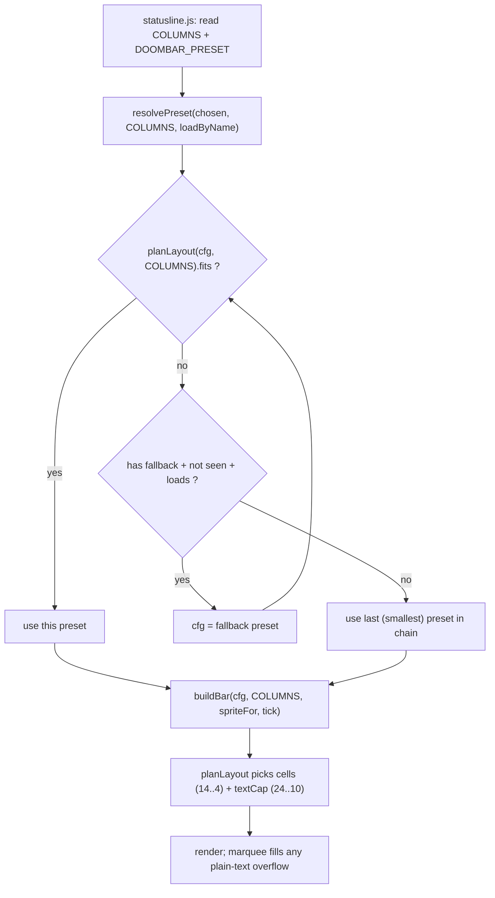

# feat: Responsive layout degradation

## Summary

Make the HUD shrink to fit the terminal, then drop to a smaller preset when it
can't shrink any further. A single lockstep scale contracts bars (14 → 4 cells)
and text (24 → 10 columns) together; whatever overflows the shrunk budget is
handled by the existing marquee. When even the minimum layout exceeds `COLUMNS`,
`statusline.js` follows a per-preset `fallback` chain (`full → standard → minimal`).
The chosen preset is the ceiling; widening recovers up to it. Everything is
stateless — each refresh re-reads `COLUMNS` and recomputes. Ships with a hard
rename `default.toml → standard.toml`.

---

## Problem Frame

The bar renders at a fixed width regardless of terminal size (see origin:
`docs/superpowers/specs/2026-06-15-responsive-layout-degradation-design.md`).
The only responsive mechanism is the bar-cell loop in `buildBar` (`src/render.js`),
which contracts bars 14 → 4. For `full` that loop is already pinned at `cells = 4`
because text labels dominate the width, so `full` is a fixed ~162-column block
that overflows any narrower terminal and just wraps. Two gaps: text never shrinks,
and there is no layout fallback when the minimum still doesn't fit.

`COLUMNS` is the width source — Claude Code sets it before each `statusLine` run
(v2.1.153+); the stdin JSON carries no width. `statusline.js` already reads
`process.env.COLUMNS || "100"` and runs with `refreshInterval: 1`, so width is
re-read about once per second.

---

## Requirements

Traced from the approved origin spec:

- **R1** Bars and text shrink together along one scale; pick the largest scale that
  fits `COLUMNS` (approach A).
- **R2** Text floor is `icon + 10` columns; bars keep their `14 → 4` range.
- **R3** Marquee-unsafe values (containing ANSI/OSC escapes — coloured text and
  hyperlinks: `loc.cwd`, `git.branch`, `pr.state`, `git.work`, `loc.churn`) have a
  hard floor at their full display width and are never column-sliced.
- **R4** When the minimum layout still overflows, switch to the next preset via a
  per-preset `[bar].fallback` key.
- **R5** The `DOOMBAR_PRESET` preset is the ceiling; degradation is downward only,
  and widening recovers up to the ceiling. No persisted state.
- **R6** Preset resolution guards against fallback cycles and missing/unreadable
  fallback files (chain ends gracefully).
- **R7** Hard rename `default.toml → standard.toml`, no back-compat alias; update
  all references.
- **R8** `render.js` stays pure (no filesystem); preset resolution lives in
  `statusline.js`.

---

## High-Level Technical Design

Responsibility split across the IO boundary, and the stateless resolution gate:

`planLayout` is the single scale ladder: for `cells` from 14 down to 4, the coupled
text cap is `textCap = round(10 + (cells - 4) / (14 - 4) * (24 - 10))` (cells 14 →
cap 24; cells 4 → cap 10). It returns the largest step whose `balancedWidth ≤ target`
with `fits = true`; if none fit, the minimum step with `fits = false`.

*Directional guidance for review, not implementation specification.*

---

## Key Technical Decisions

- **Approach A (lockstep scale), not two-phase or greedy.** One knob drives bars and
  text; predictable and testable, mirrors the existing `cells` loop generalized to
  text. (see origin) Alternatives B/C are out of scope.
- **`textCap` threads through width measurement, not a new render path.** Marquee
  budgets already derive from box width `w`; once `boxWidth`/`metricFixedWidth`
  respect `textCap`, marquee triggers on narrow layouts automatically. Only the cap
  parameter is new plumbing.
- **Marquee-unsafe = hard floor.** Detect with `!/\x1b/.test(value)`. Unsafe values
  keep full width (already-clipped to 24 upstream), so their boxes shrink less; this
  is what makes a narrow terminal trip the fallback instead of corrupting an escape.
- **Resolution as a pure helper with injected loader.** `resolvePreset(chosenCfg,
  target, loadByName)` is pure and unit-testable; `statusline.js` injects an
  fs-backed `loadByName`, tests inject a map. Keeps `render.js`/`buildBar` IO-free (R8).
- **Fallback declared in data (`[bar].fallback`).** Custom presets degrade too; the
  render just follows the chain. (see origin)

---

## Implementation Units

### U1. Generalized width scaling: `planLayout` + `textCap`

**Goal:** Replace the inline `cells` loop with a `planLayout` that scales bars and
text together, and thread `textCap` through width measurement and rendering.

**Requirements:** R1, R2, R3, R8.

**Dependencies:** none.

**Files:**
- `src/render.js` (modify): add `planLayout(cfg, target)`; add `textCap` param to
  `metricFixedWidth`, `boxWidth`, `balancedWidth`; `buildBar` calls `planLayout`
  and renders with the returned `cells` + `textCap`; preview `main()` unchanged in
  behavior (single preset, optional `tick` argv).
- `test/layout.test.mjs` (create).
- `test/render-scroll.test.mjs` (modify): per-scale assertions.

**Approach:**
- `planLayout(cfg, target) -> { cells, textCap, width, fits }`. Iterate `cells`
  14→4, derive `textCap` per the coupling formula, compute `balancedWidth(cfg,
  cells, textCap)`, return the largest fitting step (`fits=true`) or the minimum
  step (`fits=false`).
- `metricFixedWidth(entry, textCap)`: for `text`/`number`/`scroll`/`list`, cap the
  text/label portion at `textCap` **only when the value is marquee-safe**
  (`!/\x1b/.test(value)`); unsafe values keep full display width (hard floor, R3).
  Bars/ammo unchanged (driven by `cells`).
- `boxWidth(box, cells, textCap)` and `balancedWidth(cells, textCap)` pass the cap
  through; existing `min_width`/`max_width` clamps still apply on top.
- The new `textCap` parameter **defaults to 24** (the max) on `metricFixedWidth`,
  `boxWidth`, `balancedWidth` so existing exported callers (e.g.
  `test/render-scroll.test.mjs` calling `metricFixedWidth({...})`) and the preview
  `main()` keep working unchanged.
- Rendering sites need no new per-site logic — budgets already come from `w`, which
  now reflects `textCap`; marquee fills plain-text overflow as today.

**Patterns to follow:** the existing `cells` search at `src/render.js` (the 14→4
loop) and the existing marquee plumbing (`marquee`, `metricFixedWidth` scroll/list
branches) added earlier this cycle.

**Test scenarios** (`test/layout.test.mjs`):
- Wide target → `cells=14, textCap=24, fits=true`. Covers R1.
- Mid target → an intermediate `cells` with `textCap` matching the formula,
  `fits=true`.
- Sub-minimum target → `cells=4, textCap=10, fits=false`. Covers R1, R2.
- Monotonicity: as `target` decreases, returned `width` never increases; `textCap`
  equals `round(10 + (cells-4)/10*14)` at the chosen `cells`.
- `textCap` floor: chosen `textCap` is never below 10. Covers R2.

**Test scenarios** (extend `test/render-scroll.test.mjs`):
- Equal-row-width invariant holds at several scale steps (wide, mid, narrow targets).
- Plain-text value wider than the narrow `textCap` marquees (window moves across
  ticks) while every row stays equal width.
- A value containing `\x1b` (simulated hyperlink) is not sliced: its box holds the
  hard floor and no orphaned escape appears in output. Covers R3.

**Verification:** `node test/layout.test.mjs` and `node test/render-scroll.test.mjs`
pass; `node src/render.js presets/full.toml <W>` shows a narrower rendered width as
`<W>` drops (no longer pinned at 162) until the text floor is reached.

---

### U2. Rename `default → standard` and declare fallback chain

**Goal:** Rename the middle preset and wire the degradation chain in data.

**Requirements:** R4, R7.

**Dependencies:** none (independent of U1).

**Files:**
- `presets/default.toml` → `presets/standard.toml` (rename); add `fallback =
  "minimal"` to `[bar]`.
- `presets/full.toml` (modify): add `fallback = "standard"` to `[bar]`.
- `presets/minimal.toml` (verify): no `fallback` (chain terminus).
- `src/statusline.js` (modify): default preset path `presets/standard.toml`.
- `README.md`, `RELEASING.md` (modify): update `default` → `standard` references.
- `CHANGELOG.md` (modify): note the rename under Unreleased.
- `test/installer.test.mjs` and any test referencing `default.toml` (verify/modify).

**Approach:** Pure data + reference updates. Confirm no shipped code path hardcodes
the string `default.toml` other than the statusline default. Grep for `default.toml`
and `"default"` preset references before finalizing.

**Patterns to follow:** existing `[bar]` keys in `presets/*.toml`; existing default
path construction in `src/statusline.js`.

**Test scenarios:**
- `presets/standard.toml` parses and loads; `presets/default.toml` no longer exists.
- `full.toml [bar].fallback === "standard"`; `standard.toml [bar].fallback ===
  "minimal"`; `minimal.toml` has no `fallback`. Covers R4.
- Test expectation for doc/CHANGELOG edits: none — non-behavioral.

**Verification:** `npm test` passes; grep shows no stale `default.toml` references in
shipped code or docs.

---

### U3. Stateless preset resolution in `statusline.js`

**Goal:** Walk the fallback chain and pick the preset that fits `COLUMNS`, with the
chosen preset as ceiling.

**Requirements:** R4, R5, R6, R8.

**Dependencies:** U1 (uses `planLayout(...).fits`), U2 (fallback keys + names).

**Files:**
- `src/render.js` (modify): export a pure `resolvePreset(chosenCfg, target,
  loadByName)` helper that returns the chosen config (it depends only on
  `planLayout`, so it lives with the pure engine; no IO inside).
- `src/statusline.js` (modify): build an fs-backed `loadByName(name)` that resolves
  `<dir of chosen preset>/<name>.toml`, parses TOML, returns `cfg` or `null`; call
  `resolvePreset` before `buildBar` and pass the result.
- `test/layout.test.mjs` (modify) or `test/resolve-preset.test.mjs` (create):
  resolution tests with an injected loader.

**Approach:**
- `resolvePreset(chosenCfg, target, loadByName)`: walk from `chosenCfg` following
  `cfg.bar.fallback`; track a `seen` set of names for cycle safety; stop when
  `loadByName` returns `null` (missing file). Return the **first** preset whose
  `planLayout(cfg, target).fits === true`; if none fit, return the **last** (smallest)
  reached. Ceiling + bidirectional fall out of being stateless (R5): each call
  re-derives from `target`.
- `loadByName` in `statusline.js` resolves relative to the chosen preset's directory
  so custom preset sets work; returns `null` on read/parse failure (R6).

**Patterns to follow:** existing TOML parse + preset load in `src/statusline.js`
(`parseToml(readFileSync(...))`) and the defensive `readJson` null-on-failure style.

**Test scenarios** (injected loader, no FS):
- Chain `full → standard → minimal`, wide `target` → returns ceiling (`full`).
- Narrow `target` (only minimal fits) → returns `minimal`. Covers R4.
- `target` below even minimal's minimum → returns `minimal` (last in chain).
- Statelessness: same chain, two different `target` values → two different presets
  (no carried state). Covers R5.
- Cycle guard: `a.fallback="b"`, `b.fallback="a"` → terminates, no infinite loop.
  Covers R6.
- Missing fallback: `loadByName` returns `null` for the named fallback → chain ends
  at the last loaded preset. Covers R6.

**Verification:** resolution tests pass; manual `COLUMNS=40 node src/statusline.js
< sample.json` (or equivalent) renders `minimal`-shaped output, `COLUMNS=200` renders
the chosen preset.

---

## Scope Boundaries

**In scope:** the four locked decisions and three units above.

### Deferred to Follow-Up Work
- Per-box priority dropping within a single preset (the fallback unit is the whole
  preset).
- A back-compat alias for the old `default` name (explicitly declined).

### Out of scope
- Approaches B (two-phase) and C (greedy per-box).
- Changing how `min_width`/`max_width` clamps work — they still apply on top of the
  scaled widths.

---

## Risks & Dependencies

- **Risk: an all-link box wider than `COLUMNS`.** Its hard floor can exceed the
  terminal at the minimum step; `planLayout` reports `fits=false` and resolution
  falls back — the intended behaviour, not a bug. Verify in U3 manual check.
- **Risk: stale `default.toml` reference missed.** Mitigated by the grep in U2 before
  finalizing.
- **Dependency order:** U1 and U2 are independent; U3 depends on both. Land U1, U2,
  then U3.

---

## System-Wide Impact

- Public/package surface: the preset filename `default.toml` is removed (breaking for
  configs naming it). Pre-1.0; intentional per R7. CHANGELOG records it.
- `src/render.js` exported API grows (`planLayout`, `resolvePreset`); `buildBar`
  signature unchanged (still `(cfg, target, spriteFor, tick)`).
- The user's live `settings.local.json` runs `full.toml` → unaffected by the rename;
  gains degradation + fallback automatically.

---

## Sources & Research

- Origin spec: `docs/superpowers/specs/2026-06-15-responsive-layout-degradation-design.md`
  (approved design, all forks decided).
- Local grounding: `src/render.js`, `src/statusline.js`, `presets/*.toml`,
  `test/*.test.mjs` (read this cycle; strong local patterns — no external research).
- Width-signal fact (Claude Code sets `COLUMNS` v2.1.153+, resize is not a trigger,
  `refreshInterval` re-reads) confirmed via Claude Code documentation this cycle.
